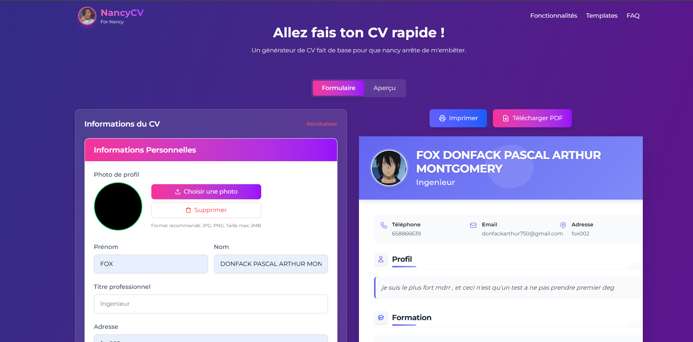

# ArborGen - Frontend : Visualiseur d'Arbres Généalogiques (Version Qui En Jette ✨)

Bienvenue dans la partie Frontend du projet ArborGen ! Ici, on ne rigole pas (enfin si, un peu), on construit une interface utilisateur si **pure**, si **moderne**, si **inspirée des Géants de la Tech (oui, vous savez de qui on parle 😉)** que même votre ancêtre le plus éloigné voudrait swiper dessus.

**Le But Ultime (à part impressionner le prof) :** Fournir une application web de **visualisation**, **création**, et **recherche** dans des arbres généalogiques. L'objectif secondaire (mais pas des moindres) est d'y appliquer des **algorithmes de Recherche Opérationnelle** (Dijkstra, Kruskal, Prim... le genre de trucs qui font chauffer les serveurs et les méninges) pour analyser les liens familiaux sous un angle... disons... optimisé !

**Statut Actuel :** On pose les fondations ! Le design et l'ergonomie sont **PRIORITÉ #1**. On veut que ça soit beau *avant* que ça calcule la distance généalogique entre Charlemagne et votre poisson rouge. Le backend en Django REST Framework est géré par un acolyte courageux (qu'on applaudit bien fort 👏).

## 🚀 Fonctionnalités Prévues (Quand on aura fini de polir les pixels)

*   **Visualisation Interactive de l'Arbre :** Un graphe dynamique (merci `vis.js` !) où l'on peut zoomer, naviguer, et ne pas se perdre (on espère).
*   **Création/Modification de Membres :** Ajouter Tante Gertrude ou modifier la date de naissance de Papy Robert (avec son accord, bien sûr).
*   **Gestion des Liens :** Spécifier qui est le père de qui, qui s'est marié avec qui (même si c'était compliqué). On gère les liens `parent` et `conjoint`, le reste se déduit (magie !).
*   **Affichage des Détails :** Un popup animé **ultra-classe** (pas une vulgaire `div` en bas de page, pitié !) pour voir la vie et l'œuvre d'un membre.
*   **Recherche Intelligente :** Trouver un membre par son nom, prénom, ou peut-être même par son plat préféré (bon, ok, peut-être pas le plat).
*   **Algorithmes de RO :** Trouver le plus court chemin entre deux membres, l'arbre couvrant minimal de la famille, etc. (La partie "sérieuse" du projet).
*   **(Plus Tard™️)** Authentification, gestion de comptes multiples (pour que chaque famille ait son jardin secret).

### Quelques Captures :



## 🛠️ La Stack Technologique (Le Meilleur du Meilleur, Modestement)

*   **React (v18+) :** Parce que les composants, c'est la vie. Et les hooks, n'en parlons pas.
*   **TypeScript :** Pour éviter les `undefined is not a function` à 3h du matin. Et parce que ça fait pro.
*   **Vite :** Parce que la vitesse de rechargement, c'est important pour le moral des troupes (de la troupe, en l'occurrence, moi).
*   **Tailwind CSS :** Pour sculpter ce design minimaliste blanc/noir sans écrire une seule ligne de CSS... ou presque. Configuré aux petits oignons pour le thème "Big Tech".
*   **Framer Motion :** Pour que les animations soient plus fluides que le déhanché de Mick Jagger.
*   **`vis.js` (Network) :** La bibliothèque qui va (on croise les doigts) transformer nos données familiales en un joli graphe compréhensible.
*   **Heroicons :** Pour des icônes fines et élégantes, style "outline".
*   **(Backend)** Django REST Framework : Il fournit l'API, on lui dit merci.

## 📂 Structure du Projet (Où Ranger Ses Chaussettes Proprement)

```
FRONTENDRO/
├── public/             # Fichiers statiques servis directement
├── src/
│   ├── assets/         # Images, polices, SVGs locaux
│   ├── components/     # Le cœur du réacteur !
│   │   ├── features/   # Composants métiers (liés à la généalogie)
│   │   │   └── genealogy/
│   │   ├── layout/     # Structure principale (Header, Sidebar, MainLayout)
│   │   └── ui/         # Petits composants réutilisables (Button, Card, Input...)
│   ├── contexts/       # Pour partager l'état sans devenir fou (ex: Sidebar state)
│   ├── hooks/          # Logique réutilisable sous forme de hooks
│   ├── pages/          # Composants représentant les vues/pages complètes
│   ├── services/       # Communication avec l'API backend (le boulot de l'ombre)
│   ├── styles/         # CSS global additionnel (si Tailwind ne suffit pas !)
│   ├── types/          # Définitions TypeScript (nos garde-fous)
│   └── utils/          # Fonctions utilitaires génériques
│   ├── App.tsx         # Composant racine (routing éventuel)
│   ├── main.tsx        # Point d'entrée JS/TS
│   └── index.css       # Directives Tailwind et styles globaux de base
├── tailwind.config.js  # La Bible de notre style
├── postcss.config.js   # Nécessaire pour Tailwind
├── vite.config.ts      # Configuration de Vite
├── tsconfig.json       # Configuration TypeScript
└── README.md           # Vous êtes ici ! -> [*Musique de carte au trésor*]
```

## 🏁 Démarrage Rapide (Accrochez-vous !)

1.  **Clonez ce dépôt** (si ce n'est pas déjà fait, mais comment liriez-vous ceci ? Mystère...).
    ```bash
    git clone [URL_DU_REPO]
    cd ArborGen/FRONTENDRO # Ou le chemin équivalent
    ```
2.  **Installez les dépendances.** Croisez les doigts et lancez :
    ```bash
    npm install
    # ou si vous êtes plutôt du genre fil (yarn)
    # yarn install
    ```
3.  **(Optionnel) Variables d'environnement :** Si un jour on a besoin de clés API secrètes (pour savoir si Papy Robert était un agent secret ?), créez un fichier `.env` à la racine basé sur `.env.example` (s'il existe).
4.  **Lancez le serveur de développement Vite :**
    ```bash
    npm run dev
    # ou
    # yarn dev
    ```
5.  Ouvrez votre navigateur à l'adresse indiquée (généralement `http://localhost:5173`). Admirez le travail (en cours) !

**Si ça explose :**
*   Avez-vous bien fait `npm install` ?
*   Votre version de Node.js est-elle compatible ? (Vérifiez le `package.json`)
*   Avez-vous essayé de supprimer `node_modules` et de refaire `npm install` ? (Le grand classique)
*   Le backend tourne-t-il (si vous essayez de fetcher des données) ?
*   Sinon... euh... bonne chance ? 😅

## 📜 Scripts Disponibles

*   `npm run dev` ou `yarn dev`: Lance le serveur de développement avec Hot Module Replacement (HMR).
*   `npm run build` ou `yarn build`: Compile l'application pour la production dans le dossier `dist/`.
*   `npm run lint` ou `yarn lint`: Lance ESLint pour vérifier la qualité du code (si configuré).
*   `npm run preview` ou `yarn preview`: Lance un serveur local pour prévisualiser le build de production.

## ✨ Philosophie de Style (Le Dogme du Blanc & Noir Pur)

On ne plaisante pas avec le design ici. L'objectif est un look **ultra-moderne, minimaliste, inspiré par Apple/Google**, utilisant principalement le **blanc pur**, le **noir pur**, et des **gris neutres**.

*   **Tailwind CSS est roi :** On utilise les classes utilitaires au maximum. La configuration dans `tailwind.config.js` définit notre palette stricte, nos ombres subtiles, nos coins arrondis modernes.
*   **Effet Verre Dépoli :** Utilisé sur le Header (`backdrop-blur`) pour un look sophistiqué.
*   **Animations :** Fluides et discrètes grâce à `framer-motion`, notamment pour la sidebar rétractable.
*   **Composants UI :** Les composants dans `src/components/ui` sont la base réutilisable de notre design system (boutons noirs sur fond blanc, inputs épurés...).
*   **CSS Perso :** Uniquement pour des choses que Tailwind gère moins bien (certains styles globaux très spécifiques, styles de scrollbar éventuels) dans `src/index.css`.

Bref, on vise le genre de design qui vous fait sentir intelligent rien qu'en le regardant.

## 🗺️ Roadmap (Ce Qui Nous Attend)

1.  ✅ Mettre en place le Layout principal (Header, Sidebar rétractable).
2.  ✅ Définir le style "Big Tech" Blanc/Noir Pur avec Tailwind.
3.  ✅ Intégrer `vis.js` dans un composant React dédié (`GenealogyGraph.tsx`).
4.  ⬜ Connecter les données (mockées au début, puis API) au graphe.
5.  ✅ Implémenter le popup animé pour les détails du membre.
6.  ⬜ Finaliser la logique des formulaires (Ajout/Lien, Recherche).
7.  ⬜ Connecter les appels aux services API (Backend DRF).
8.  ⬜ (Plus tard) Implémenter les algos de RO.
9.  ⬜ (Encore plus tard) Authentification & Co.
10. 🚀 Dominer le monde... des projets de Recherche Opérationnelle !

## 👋 Contribution

Pour l'instant, c'est un projet solo (ou petite équipe). Si vous tombez sur ce code et avez des idées géniales, n'hésitez pas à ouvrir une *Issue* pour en discuter !

## 📜 Licence

Probablement MIT, mais on verra quand on aura quelque chose à licencier ! 😉

---

*Et voilà ! Que la force (et le design épuré) soit avec nous.*

